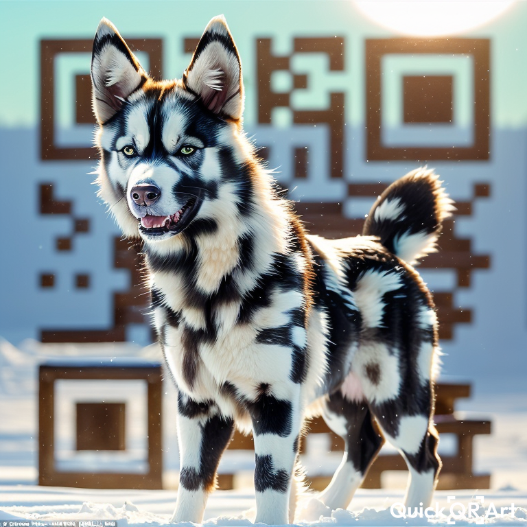

I have never worked in Apple、Google、Microsoft or even Alibaba. I have never been engaged in iOS、macOS or reverse engineering. Now I am committed to Android applications and hybrid development. I am not an expert in professional compilers, but just a senior CV engineer.

<!--
**MALTF/MALTF** is a ✨ _special_ ✨ repository because its `README.md` (this file) appears on your GitHub profile.

### I am a senior CV engineer.
我既没有在苹果谷歌微软工作过，甚至都没有在阿里巴巴工作过，从未从事iOS、macOS和逆向工程，现在我致力于Android应用以及混合开发开发，我不是专业编译器的专家，仅仅是一个高级CV工程师而已。

Here are some ideas to get you started:

- 🔭 I’m currently working on ...
- 🌱 I’m currently learning ...
- 👯 I’m looking to collaborate on ...
- 🤔 I’m looking for help with ...
- 💬 Ask me about ...
- 📫 How to reach me: ...
- 😄 Pronouns: ...
- ⚡ Fun fact: ...
-->
